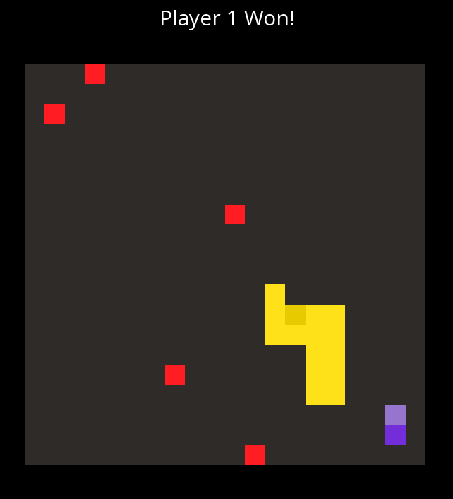
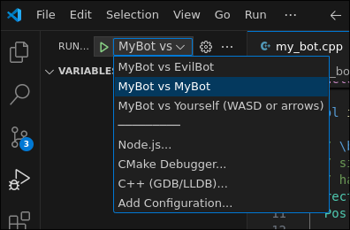

# DU CODE Snake Programming Competition

Howdy! This is the repo for Denison University's Coding Club Snake
Programming Competition. Participants will code a Snake bot in C++ to
face off against others. The winner will be crowned Coding Supreme.

# Game format

The game is very similar to classic snake except there are two snakes.
Every timestep, the head of each snake will go up, down, left, or right and
a fruit will spawn on a regular interval. If the head of one snake runs into the
edge, itself, or the other snake, it loses. If the heads of the snakes run into
each other, the game is considered a draw. And of course, if a fruit is eaten,
the snake gets longer.

If the game is not over at the start of the 100th time step, the longer snake
will win or both draw if they are the same size.

Competitors will implement a bot to control their snake as detailed below.

# Writing a bot

Your bot will be implemented in `src/MyBot.cpp`, this is what will be
submitted. You may write additional helper methods and functions but they
must be contained within that single file and you may not modify the
signature of the `think` function. You can of course create more scripts
to test your bot, but in the end, `MyBot.cpp` is what will be submitted.

The `think` function is what will be called every time step and is what
determines what your bot does. the `think` function returns a `Direction` and
takes in a `Grid` as a parameter. See the
[documentation](https://joel-singh.github.io/denison-snake-programming-competition/).
The `Grid` class contains the information for what is on the board.

To start, you'll want to read [the compilation
instructions](https://github.com/Joel-Singh/denison-snake-programming-competition/blob/master/documentation/COMPILING.md)
which also includes how to get the project set up for specifically VSCode.
It'll guide you in installing a cpp compiler and running the project. If
compiling provides a hurdle in you participating, sessions are being run every
Thursday in Olin 311 from 7 to 8 pm to help with DU Slither!

# Testing your bot

When running this project, there are three options for testing: 

- MyBot vs EvilBot (contained in `src/EvilBot`.) Evil bot is simply another bot you can customize to go against MyBot.
- MyBot vs yourself (controls are WASD or arrow keys)
- MyBot vs MyBot

After following [the compilation
instructions](https://github.com/Joel-Singh/denison-snake-programming-competition/blob/master/documentation/COMPILING.md), you'll be able to select which option through the VSCode run and debug menu:

# Additional Rules

- You may work alone or in a group (no size limit)

- Submissions will be due Oct. 9th Thursday at 8 pm. A google form for submission will be sent out a week before.

- The actual competition will occur on Oct. 11th Saturday. Every match will be streamed live.

- Any bugs found will be fixed up to September 18th. After that, unless a bug
is particularly egregious, they will remain as part of the "official" game.
Please immediately tell Joel if you find any bugs!

# FAQ

What is the competition format?

- The actual tournament format is TBD
- We will all meet and the most interesting games / bots will be picked
out and discussed along with running the tournament for a winner.

I'm having issues compiling and running the project

- Contact Joel on the Coding Club discord server or show up to the daily DU Slither help meets on Thursdays from 7 to 8 pm in Olin 311.

Can I use AI?

no.

Will there be resource limits on the bots?

Yes, but for the purpose of logistics rather than an actual limitation on you.
Every bot will receive 2 gigs of ram, 1 gigahertz of CPU, and 5 seconds every
game tick to think in the tournament. Unlike a computationally expensive game
like Chess, computing the logic for this game should not reach anywhere near
these limits unless you accidentally have an infinite loop.

Can I use the standard cpp library?

Yes, except for parts that obviously don't make sense such as network or IO. Also, you may not use
`std::srand`, this is done already in main, just use `std::rand`.

# Attributions

I was heavily inspired by Sebastian Lague's [Chess Challenge](https://github.com/SebLague/Chess-Challenge) and this idea for two player snake was taken from one of his [unfinished projects.](https://youtu.be/kIMHRQWorkE?t=711)
